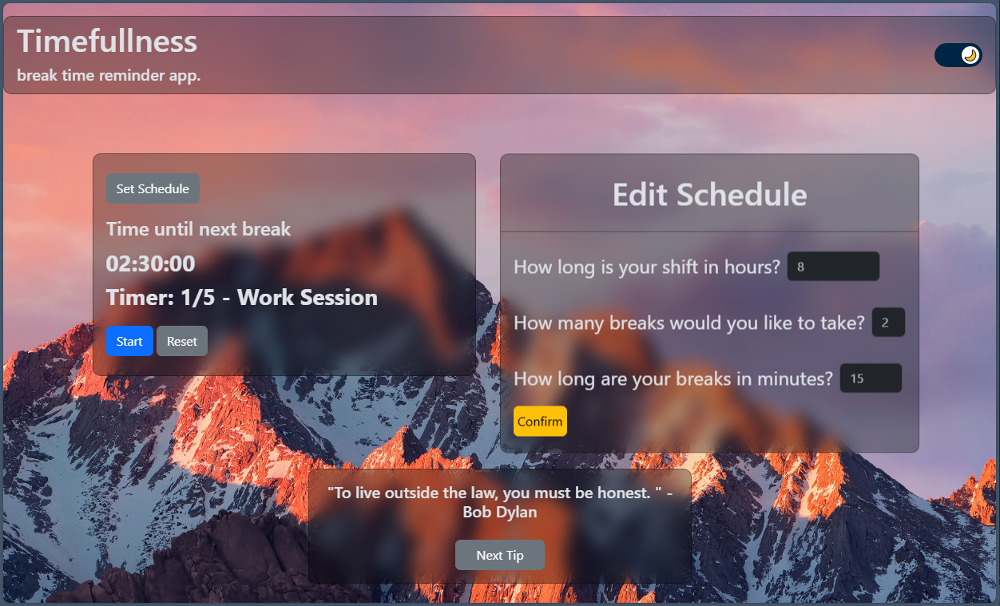

# Timefullness

Timefullness is a project aimed at helping remote workers remember to take their breaks. Timefullness has a customizable schedule along with tips to make your break more successful.

## Features
- Time tracking
- Reminders and notifications
- Customizable schedule
- Motivational quotes and helpful tips
- Light and dark mode toggle

## Screenshot

## Usage

### Start and stop timer
Click start button to start the timer. Start button transforms into a pause button. Click pause button to resume timer. 

### Customize Default schedule 
Default schedule is auto set for shift duration: 8, number of breaks: 2, duration of each break: 15 minutes.
Click edit schedule button and fill out total duration of work, how many breaks you would like to take, and the duration of total breaks. Click confirm to complete. 

### Motivational quotes and tips
- The bottom of the screen will display motivational quotes you can click next quote to advance it to a different motivational quote. When timer is on break time you will see tips to enhance your break time experience.
- Go to https://cors-anywhere.herokuapp.com/ to use proxy to bypass CORS restriction on client side to allow access motivational quotes API before using web application.

### Light and dark mode toggle
Click on the toggle and change light/dark theme to address eye strain

## More information
- Repo: https://github.com/EnderJunk/Timefullness
- Published: https://enderjunk.github.io/Timefullness/